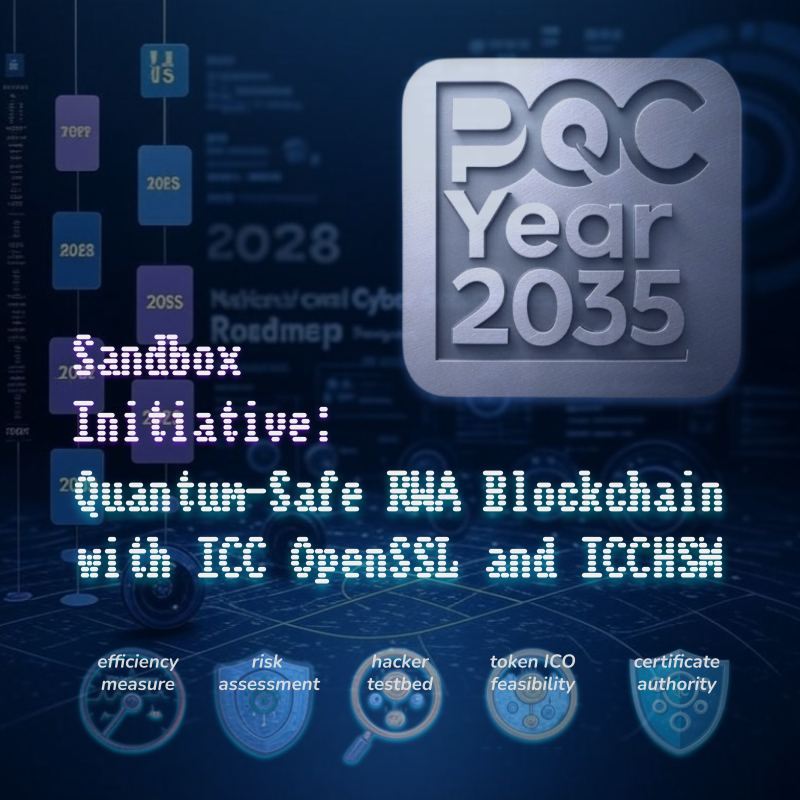

<div align="center">
  
  <h1><strong>PQC/2035 Sandbox Initiative</strong></h1>
  <h3><strong>Quantum-Safe RWA Blockchain with ICC OpenSSL & ICCHSM</strong></h3>
  <h3>White Paper</h3>
</div>
<br>

## Table of Contents

- [Abstract](#abstract)
- [1. Introduction](#1-introduction)
  - [Sandbox Implementation](#sandbox-implementation)
- [2. Background](#2-background)
  - [2.1 Post-Quantum Cryptography (PQC)](#21-post-quantum-cryptography-pqc)
  - [2.2 PQC Signatures and KEM for Ethereum Integration](#22-pqc-signatures-and-kem-for-ethereum-integration)
  - [2.3 ICC OpenSSL and ICCHSM](#23-icc-openssl-and-icchsm)
  - [2.4 OpenVPN](#24-openvpn)
  - [2.5 Hyperledger Besu](#25-hyperledger-besu)
- [3. Architecture](#3-architecture)
  - [3.1 High-Level Architecture Diagram](#31-high-level-architecture-diagram)
  - [3.2 PQC Blockchain Structure](#32-pqc-blockchain-structure)
    - [RWA Blockchain Framework Structure Diagram](#rwa-blockchain-framework-structure-diagram)
- [4. Implementation Details](#4-implementation-details)
  - [4.1 Installing ICC OpenSSL](#41-installing-icc-openssl)
  - [4.2 Installing and Configuring ICCHSM](#42-installing-and-configuring-icchsm)
  - [4.3 Configuring OpenVPN with ICC OpenSSL](#43-configuring-openvpn-with-icc-openssl)
    - [4.3.1 Generate PQC Keys and Certificates](#431-generate-pqc-keys-and-certificates)
    - [4.3.2 OpenVPN Configuration](#432-openvpn-configuration)
    - [4.3.3 Framework Diagram 1: OpenVPN Initialization and TLS Handshake with Besu Context](#433-framework-diagram-1-openvpn-initialization-and-tls-handshake-with-besu-context)
    - [4.3.4 Framework Diagram 2: OpenVPN Data Channel and ICC OpenSSL with Besu](#434-framework-diagram-2-openvpn-data-channel-and-icc-openssl-with-besu)
    - [4.3.5 Start OpenVPN](#435-start-openvpn)
  - [4.4 Configuring Hyperledger Besu with ICCHSM Multisig](#44-configuring-hyperledger-besu-with-icchsm-multisig)
    - [4.4.1 Install Besu](#441-install-besu)
    - [4.4.2 Validator Node: ICCHSM Multi-Signature for Transaction Proofs](#442-validator-node-icchsm-multi-signature-for-transaction-proofs)
    - [4.4.3 Miner Node: ICCHSM Multi-Signature for Root Hashes](#443-miner-node-icchsm-multi-signature-for-root-hashes)
    - [4.4.4 Configure Besu P2P over OpenVPN](#444-configure-besu-p2p-over-openvpn)
- [5. ICCHSM PQC Methods](#5-icchsm-pqc-methods)
- [6. System Requirements](#6-system-requirements)
- [7. Demonstration Programs with Solidity Smart Contracts](#7-demonstration-programs-with-solidity-smart-contracts)
  - [7.1 ICOToken and LockingContract on Hyperledger Besu](#71-icotoken-and-lockingcontract-on-hyperledger-besu)
  - [7.2 WrappedICOToken and MintingContract on Ethereum](#72-wrappedicotoken-and-mintingcontract-on-ethereum)
  - [7.3 Cross-Chain Bridge with PQC Multi-Signature](#73-cross-chain-bridge-with-pqc-multi-signature)
  - [7.4 Miner-Signature-Contract (Block Root Signing)](#74-miner-signature-contract-block-root-signing)
  - [7.5 Quantum-Safe Multi-Signatures and Trust-Minimized Cross-Chain Security](#75-quantum-safe-multi-signatures-and-trust-minimized-cross-chain-security)
- [8. Security Analysis](#8-security-analysis)
- [9. Performance Considerations](#9-performance-considerations)
- [Conclusion](#conclusion)
- [Technology Partners](#technology-partners)
    
---

## Abstract

Quantum computing advancements threaten the cryptographic foundations of blockchain systems, particularly traditional algorithms like RSA and ECC. Permissioned blockchains, vital for enterprise applications due to their controlled access and privacy, require quantum-resistant solutions to protect sensitive data. This whitepaper presents a robust framework for constructing a post-quantum secure (PQC) permissioned blockchain using **Hyperledger Besu** as the blockchain platform, **ICC OpenSSL** for quantum-resistant cryptography, **ICCHSM** for PQC encryption and multi-signature operations, and **OpenVPN** for secure node communication. We provide detailed reference procedures, framework diagrams, and Solidity smart contract examples to demonstrate practical implementation, ensuring enterprises can future-proof their blockchain deployments against quantum threats through a dedicated Sandbox “PQC/2035” initiative.

---

## 1. Introduction

Blockchain technology ensures security, integrity, and authenticity through cryptographic mechanisms. Permissioned blockchains, with restricted access and governance, are ideal for enterprise use cases such as supply chain management, financial systems, and healthcare. However, quantum computing advancements, particularly Shor’s algorithm, threaten to break traditional cryptographic schemes like RSA and ECC, exposing these systems to future risks.

Post-Quantum Cryptography (PQC) offers algorithms resistant to quantum attacks, ensuring long-term security. The primary goal of this project is to complete a Sandbox initiative named **“PQC/2035”**, designed to test the efficiency, security, and feasibility of a PQC-enabled blockchain. The Sandbox will evaluate the performance of a PQC VPN blockchain, assess security risks, provide a platform for hacker testing, and explore the viability of Initial Coin Offering (ICO) in the primary token market connected via a blockchain bridge. This whitepaper outlines a comprehensive approach to building a PQC-enabled permissioned blockchain by integrating **ICC OpenSSL** for quantum-safe cryptography, **ICCHSM** for PQC encryption and multi-signature operations, **OpenVPN** for secure communication, and **Hyperledger Besu** as the permissioned blockchain platform. Enhanced framework diagrams, detailed procedures, and smart contracts woth DApp examples provide a practical roadmap for implementation within the Sandbox “PQC/2035” framework.

### Sandbox Implementation

The Sandbox “PQC/2035” is a controlled testing environment designed to validate the quantum-safe RWA blockchain framework. Its objectives are:

| Task                       | Description                                                                                                                    |
|----------------------------|-------------------------------------------------------------------------------------------------------------------------------|
| **Efficiency Testing**     | Measure the performance of the PQC VPN blockchain, including transaction throughput, latency, and PQC multi-signature processing times. Benchmarks compare PQC algorithms (e.g., ML-DSA, ML-KEM) against traditional cryptography under various network conditions. |
| **Security Risk Assessment** | Identify vulnerabilities in the PQC implementation, focusing on cryptographic strength, key management, and smart contract security. Conduct penetration testing to evaluate resistance to quantum and classical attacks. |
| **Hacker Testing Platform** | Provide a secure environment for ethical hackers to stress-test the blockchain, simulating quantum-enabled attacks on PQC algorithms and VPN tunnels to validate robustness. |
| **Token ICO Feasibility**  | Assess the viability of a primary market token Initial Coin Offering (ICO) connected via the blockchain bridge (Section 7.2). Test cross-chain token transfers, PQC multi-signature validation, and regulatory compliance to ensure a secure and scalable ICO process. |
| **Future Plan**  | Implement a PQC-based Certificate Authority and establish a Layer 2 Credential Ledger integrated with Quantum Key Distribution (QKD) for secure identity and credential management. |

The Sandbox leverages the demonstration programs (Section 7) to simulate real-world scenarios, providing data to refine the blockchain for enterprise deployment.

---

## 2. Background

### 2.1 Post-Quantum Cryptography (PQC)

PQC encompasses cryptographic algorithms designed to withstand both classical and quantum attacks. Unlike RSA or ECC, PQC relies on problems such as lattice-based or code-based mathematics, believed to resist quantum algorithms. Key NIST-standardized candidates include:

```info
ML-DSA (Dilithium): A lattice-based digital signature scheme for authentication and signing.
ML-KEM (Kyber):     A lattice-based key encapsulation mechanism for secure key exchanges.
SLH-DSA (Sphincs+): A stateless hash-based signature scheme.
FALCON:             A lattice-based signature scheme using the hash-and-sign paradigm.
```

   
### 2.2 PQC Signatures and KEM for Ethereum Integration

| Scheme                 | Signature Method | KEM Method | Signature Length       | % of Max Log Entry Data (Ethereum Block Size of 3.75 MB) | Estimated Gas Cost     | Notes                                                             |
| ---------------------- | ---------------- | ---------- | ---------------------- | ------------------------- | ---------------------- | ---------------------------------------------------------------- |
| **ML-DSA (Dilithium)** | ✅ Yes            | ❌ N/A      | **2,420–4,627 bytes**  | **0.06%–0.12%**                   | **19,735–37,371 gas**  | Signature size depends on Dilithium levels (FIPS 204) |
| **SLH-DSA (SPHINCS+)** | ✅ Yes            | ❌ N/A      | **7,856–49,856 bytes** | **0.21%–1.33%**                   | **62,233–399,223 gas** | Large stateless hash-based signatures (FIPS 205)      |
| **FALCON**             | ✅ Yes            | ❌ N/A      | **666–1,280 bytes**    | **0.02%–0.03%**                   | **5,703–10,615 gas**   | Compact lattice-based signatures (FIPS 203)           |
| **ML-KEM (Kyber)**     | ❌ N/A            | ✅ Yes      | *Not Applicable*       | *Not Applicable*                  | *Not Applicable*       | Kyber is a Key Encapsulation Mechanism (FIPS 203)     |

```note Ethereum Block Size Context
Block Gas Limit: ~30,000,000 gas
Log Entry Cost:
     Fixed base cost: 375 gas
     Per byte of `data` field: 8 gas/byte
Max Log Entry Data Field Size:
     (30,000,000 - 375) / 8
     ≈ 3,749,953 bytes (~3.75 MB)
```
   
```note Gas Cost Calculation Formula
Gas Cost
     = 375 + 8 × signature_length
```

### Practical Considerations

* **Small PQC Signatures (e.g., FALCON, Dilithium):**
  Gas-efficient and feasible for on-chain logging or verification in smart contracts.

* **Large PQC Signatures (e.g., SPHINCS+):**
  Can incur **over 300,000 gas**, which is significant for single transactions and may not be efficient for frequent or large-scale use in contracts.

* **ML-KEM (Kyber):**
  Being a KEM, Kyber does not produce signatures and is used for key encapsulation; unsuitable for digital signature needs in Ethereum logs.

While all post-quantum signature schemes are technically viable within Ethereum's theoretical gas and size limits, **signature size directly impacts gas consumption**. For real-world use in smart contracts or log entries, **Falcon and Dilithium offer better trade-offs**, whereas **SPHINCS+** provides strong security but at a higher gas cost.

    
### 2.3 ICC OpenSSL and ICCHSM

**ICC OpenSSL** extends the OpenSSL library by integrating <a href="https://www.ironcap.ca">IronCAP</a>'s PQC algorithms, enabling quantum-resistant key generation, encryption, and signing. It serves as the cryptographic backbone for OpenVPN and supports Besu’s transaction signing.
   
**ICCHSM** is a software implementation of the <a href="https://www.ironcap.ca">IronCAP</a>'s cryptographic Hardware Security Module (HSM) with a PKCS#11 interface, providing PQC encryption and signing capabilities. It supports single-purpose and dual-purpose keys for key encapsulation and digital signatures, including multi-signature operations for blockchain root hashes and smart contracts. ICCHSM enables Besu decentralized applications (DApps) to implement PQC multi-signatures, enhancing security for critical operations.

      
### 2.4 OpenVPN

**OpenVPN** is an open-source VPN solution that secures point-to-point and site-to-site connections. Configured with <a href="https://www.ironcap.ca">IronCAP</a>'s ICC OpenSSL, it uses PQC algorithms to establish quantum-safe tunnels, protecting Besu’s peer-to-peer (P2P) communication.

   
### 2.5 Hyperledger Besu

**Hyperledger Besu**, an open-source Ethereum client under the Hyperledger project, supports permissioned networks tailored for enterprise needs. It handles transaction signing, consensus (e.g., QBFT or IBFT 2.0), and P2P communication, which we enhance with PQC via <a href="https://www.ironcap.ca">IronCAP</a>'s ICC OpenSSL and ICCHSM.

---

## 3. Architecture

The architecture integrates Hyperledger Besu, ICC OpenSSL, ICCHSM, and OpenVPN to create a PQC-enabled permissioned blockchain, tested within the Sandbox “PQC/2035”. Besu nodes handle blockchain operations, ICC OpenSSL and ICCHSM provide quantum-resistant cryptography, and OpenVPN ensures secure communication over PQC-protected tunnels.

   
### 3.1 High-Level Architecture Diagram

```note
                     [QUANTUM-SAFE RWA BLOCKCHAIN ARCHITECTURE]

+-----------------------------------+          +-----------------------------------+
| Application Node (Site A)         |          | Validator Node (Site B)           |
| # Hyperledger Besu (EVM)          |          | # Hyperledger Besu (EVM)          |
| --------------------------------- |          | --------------------------------- |
| - Smart Contract Interaction      |          | - Validates Transactions          |
| - DApp API Access & Submission    |          | - Multi-Signs Tx Proofs (ICCHSM)  |
| - UI Layer Integration            |          | - Emits PQC Signatures to         |
|                                   |          |   Event Logs                      |
| - P2P Comm. (via OpenVPN)         |          | - P2P Comm. (via OpenVPN)         |
+-----------------------------------+          +-----------------------------------+
         |                                              |
         | [OpenVPN Tunnel (PQC-Secured)]               | [OpenVPN Tunnel (PQC-Secured)]
         | - PQC-SSL (ICC OpenSSL)                      | - PQC-SSL (ICC OpenSSL)
         | - Key Exchange (ML-KEM)                      | - Key Exchange (ML-KEM)
         | - Authentication (ML-DSA)                    | - Authentication (ML-DSA)
         | - Encrypted Data (AES-256-GCM)               | - Encrypted Data (AES-256-GCM)
         +----------------------------------------------+
                    [Secure Internet]
                           |
                           v
+-----------------------------------+
| Miner Node (Site C)              |
| Hyperledger Besu (EVM)           |
| -------------------------------- |
| - Commits Root Hashes            |
| - Multi-Signs Root Hash (ICCHSM) |
| - Emits Signature to Event Log   |
| - Consensus (QBFT / IBFT 2.0)    |
| - P2P Comm. (via OpenVPN)        |
+-----------------------------------+

         +--------------------------------------------------------------+
         |                        Future Integration                    |
         | ------------------------------------------------------------ |
         | - PQC Certificate Authority (PQC-CA):                        |
         |   Issue and manage quantum-safe certificates for users.      |
         | - QKD Layer 2 Credential Ledger:                             |
         |   Distribute session keys using  Quantum Key Distribution,   |
         |   enabling Layer 2 identity and credential synchronization.  |
         +--------------------------------------------------------------+

```

This diagram shows Besu nodes communicating securely over OpenVPN tunnels, with PQC algorithms (e.g., ML-KEM and ML-DSA) ensuring quantum resistance. ICC OpenSSL is an OpenSSL extension supporting PQC internet workflow. ICCHSM provides PQC multi-signature capabilities for securing root hashes, transactions and smart contracts.
   
   
### 3.2 PQC Blockchain Structure

The PQC Blockchain is designed with quantum-safe mechanisms at both the **communication** and **operational** layers. The architecture has been evaluated and validated within the Sandbox environment “**PQC/2035**”. Each node type—Application, Validator, and Miner—has distinct roles in securing and maintaining the blockchain.

#### Core Components

* **PQC Event Log Multi-Signatures**
  Rather than storing post-quantum signatures directly in contract state (which is gas-expensive), validator and miner nodes emit PQC signatures to smart contract **event logs**:

  * **Validators** emit signatures verifying transaction proofs.
  * **Miners** emit signatures for root hash commitments.

* **ICCHSM-Based Multi-Signatures**
  ICCHSM enables hardware-accelerated quantum-safe signatures using PQC algorithms such as **ML-DSA**, **SLH-DSA**, or **FALCON**. These are used to:

  * Sign root hashes before block finalization.
  * Verify transaction batches by validators.
  * Secure smart contract deployments when necessary.

* **Quantum-Safe Smart Contract Interactions**
  Smart contracts interact with DApps through PQC-authenticated interfaces and support **multi-signature verification** using event-based PQC logs for lightweight trust anchoring.

* **PQC-Secured Communication Layer**
  All inter-node communication runs over **OpenVPN tunnels**, protected with:

  * **ICC OpenSSL** with integrated PQC support
  * **ML-KEM or other PQC KEM** (key exchange via ICC)
  * **ML-DSA or other PQC Signatures** (node authentication via ICC)
  * **AES-256-GCM** (for data confidentiality)

#### Future Extensions

* **PQC Certificate Authority (PQC-CA)**
  A dedicated authority to issue and manage **quantum-safe digital certificates** for nodes (miners, validators, application interfaces) to ensure verified trust chains.

* **QKD Layer 2 Credential Ledger**
  Integration of **Quantum Key Distribution (QKD)** to deliver secure session keys and root secrets for Layer 2 identity and credential synchronization across blockchain and messaging layers.

#### RWA Blockchain Framework Structure Diagram

```note
note
+-------------------------------+
| Hyperledger Besu Blockchain   |
|   (Permissioned Ethereum)     |
|                               |
| +---------------------------+ |
| | Block Structure           | |
| | - Root Hash               | |
| | - Transactions            | |
| | - Event Log PQC Multi-Signatures | |
| |   (Validator & Miner)     | |
| +---------------------------+ |
|                               |
| +---------------------------+ |
| | PQC Smart Contracts       | |
| | - PQC Multi-Sig (ICCHSM)  | |
| | - Signed Interactions     | |
| | - Event-based Proof Logs  | |
| +---------------------------+ |
|                               |
| +---------------------------+ |
| | PQC Enhanced Consensus    | |          
| | (QBFT or IBFT 2.0)        | |
| | - Miner Root Hash Voting  | |
| | - Validator Tx Proofing   | |
| +---------------------------+ |
|                               |
| +---------------------------+ |
| | PQC P2P Communication     | |
| | - OpenVPN (PQC Tunnel)    | |
| | - PQC-SSL (ICC OpenSSL)   | |
| | - Key Exchange (ML-KEM via ICC)   | |
| | - Auth (ML-DSA via ICC)   | |
| +---------------------------+ |
|                               |
| +---------------------------+ |
| | Future Extensions         | |
| | - PQC Certificate Auth    | |
| | - QKD Credential Ledger   | |
| +---------------------------+ |
+-------------------------------+
```

This diagram illustrates the RWA blockchain’s structure, highlighting PQC integration in block signing, smart contracts, consensus, and communication, all of which are tested in the Sandbox “PQC/2035”.

---

## 4. Implementation Details

This section provides detailed procedures for implementing the PQC-enabled blockchain, enriched with reference steps and examples, designed to support the Sandbox “PQC/2035” testing environment.
 
   
### 4.1 Installing ICC OpenSSL

ICC OpenSSL provides the foundation for PQC cryptography.

#### On Linux (Ubuntu/Debian):
1. **Download**:
   ```bash
   wget icc-openssl_6.0.y-z_amd64.deb
   ```
2. **Install**:
   ```bash
   sudo dpkg-deb -x icc-openssl_6.0.y-z_amd64.deb  /home/iccOpenSSL 
   ```
3. **Verify**:
   ```bash
   /path/to/icc-openssl/bin/openssl version
   ```
   Expected output: `ICC OpenSSL 6.0`.
4. **Set Library Path**:
   ```bash
   export LD_LIBRARY_PATH=/path/to/icc-openssl/lib:$LD_LIBRARY_PATH
   ```

   
### 4.2 Installing and Configuring ICCHSM

ICCHSM provides PQC encryption and multi-signature capabilities.

#### On Linux (Ubuntu/Debian):
1. **Download**:
   ```bash
   wget icchsm_6.0.y-z_amd64.deb
   ```
2. **Install**:
   ```bash
   sudo dpkg -i icchsm_6.0.y-z_amd64.deb
   ```
3. **Set Environment Variable**:
   ```bash
   export SOFTHSM2_CONF=/usr/local/etc/softhsm2.conf
   ```
4. **Initialize Token**:
   ```bash
   sudo softhsm2-util --module /usr/lib/softhsm/libsofthsm2.so --init-token --free --label "PQCToken" --pin 123456 --so-pin 123456
   ```

   
### 4.3 Configuring OpenVPN with ICC OpenSSL

OpenVPN secures Besu’s P2P communication using PQC-enabled tunnels, critical for Sandbox “PQC/2035” efficiency testing.
   
#### 4.3.1 Generate PQC Keys and Certificates
```bash
# CA key and certificate
# (Kyber KEM + Dilithium2 Signing for CA authenticity)
cd /path/to/icc-openssl/bin
./openssl genicc -bsl 128 -type shake256-kyber-li2 -out ca_key.pem
./openssl req -config openssl.cnf -keyform pem -key ca_key.pem -new -x509 -days 3650 -shake256 -extensions v3_ca -out ca_cert.pem

# Server key and certificate
./openssl genicc -bsl 128 -type shake256-kyber-li2 -out server_key.pem
./openssl req -config openssl.cnf -new -shake256 -keyform pem -key server_key.pem -out server.csr
./openssl ca -config icc-ca-shake256-kyber-li2.cnf -keyform pem -days 365 -md shake256 -in server.csr -out server_cert.pem

# Client key and certificate
./openssl genicc -bsl 128 -type shake256-kyber-li2 -out client_key.pem
./openssl req -config openssl.cnf -new -shake256 -keyform pem -key client_key.pem -out client.csr
./openssl ca -config icc-ca-shake256-kyber-li2.cnf -keyform pem -days 365 -md shake256 -in client.csr -out client_cert.pem
```
   
#### 4.3.2 OpenVPN Configuration
- **Server (`server.ovpn`)**:
  ```plaintext
  port 1194
  proto udp
  dev tun
  tls-version-min 1.3
  dh none
  ca ca_cert.pem
  cert server_cert.pem
  key server_key.pem
  server 10.8.0.0 255.255.255.0
  cipher AES-256-GCM
  tls-cipher TLS1.3-KYBER-DSA-AES256GCM-SHA384
  ```
- **Client (`client.ovpn`)**:
  ```plaintext
  client
  remote <server-ip> 1194
  proto udp
  dev tun
  tls-version-min 1.3
  dh none
  ca ca_cert.pem
  cert client_cert.pem
  key client_key.pem
  cipher AES-256-GCM
  tls-cipher TLS1.3-KYBER-DSA-AES256GCM-SHA384
  ```
   
#### 4.3.3 Framework Diagram 1: OpenVPN Initialization and TLS Handshake with Besu Context

```note
Initialization Phase:
[OpenVPN Server]                              [OpenVPN Client]
  | Load CA, Server Cert/Key                   | Load CA, Client Cert/Key
  | (ICC OpenSSL: PQC KEM + ML-DSA)            | (ICC OpenSSL: PQC KEM + ML-DSA)
  | [Besu Node P2P Config]                     | [Besu Node P2P Config]

TLS Handshake (Quantum-Safe):
[OpenVPN Server]                               [OpenVPN Client]
  | <--- ClientHello ------------------------> | (includes Kyber+DSA)
  | --- ServerHello, Cert -------------------> | Present server cert (ML-DSA)
  | <--- Client Cert, KeyEx -----------------> | Send client cert & Kyber KeyEx
  | Verify client cert (ML-DSA)                |
  | --- Complete key exchange ---------------> | Derive AES-256-GCM session key
  | [Besu P2P: Secure Tunnel Ready]            | [Besu P2P: Secure Tunnel Ready]
```

This diagram integrates Besu by showing how the OpenVPN handshake prepares a secure tunnel for Besu’s P2P communication.
   
#### 4.3.4 Framework Diagram 2: OpenVPN Data Channel and ICC OpenSSL with Besu

```note
[OpenVPN Server]                               [OpenVPN Client]
+---------------------+                         +---------------------+
| - TLS (Kyber/DSA)   | <--- Data Channel --->  | - TLS (Kyber/DSA)   |
| - Data (AES-256-GCM)|      (PQC Secured)      | - Data (AES-256-GCM) |
| [Besu P2P Traffic]  |                         | [Besu P2P Traffic]  |
+---------------------+                         +---------------------+
| ICC OpenSSL         |                         | ICC OpenSSL         |
| - genicc (KEM keys) |                         | - genicc (KEM keys) |
| - iccutl (encrypt)  |                         | - iccutl (decrypt)  |
| - Sign/Verify       |                         | - Sign/Verify       |
+---------------------+                         +---------------------+
```

This diagram emphasizes Besu’s P2P traffic flowing through the quantum-safe OpenVPN tunnel, supported by ICC OpenSSL’s PQC capabilities.
   
#### 4.3.5 Start OpenVPN
```bash
# On Server
openvpn --config server.ovpn

# On Client
openvpn --config client.ovpn
   
```
   
### 4.4 Configuring Hyperledger Besu with ICCHSM Multisig

Besu is adapted to use ICC OpenSSL for transaction signing and ICCHSM for PQC multi-signature operations.

#### 4.4.1 Install Besu
```bash
wget https://github.com/hyperledger/besu/releases/download/<version>/besu-<version>.tar.gz
tar -xzf besu-<version>.tar.gz
export PATH=$PATH:/path/to/besu-<version>/bin
besu --version
```
   
#### 4.4.2 Validator Node: ICCHSM Multi-Signature for Transaction Proofs

Validators use ICCHSM to co-sign transaction proofs before emitting them to smart-contract event logs. This ensures quantum-resistant verification of each transaction batch.

```bash
# Generate a Dilithium2 key pair for validator multi-signature
icc-tool \
  --module /usr/lib/softhsm/libsofthsm2.so \
  --slot <validator-slot> --login --pin <pin> \
  --keypair --key-type shake256-dilithium2 \
  --id 201 --label "ValidatorMultiSigKey"

# Sign transaction proof data (tx_proof.bin)
icc-tool \
  --module /usr/lib/softhsm/libsofthsm2.so \
  --slot <validator-slot> --login --pin <pin> \
  --sign --mechanism CKM-ICC-DILITHIUM2 \
  --id 201 -i tx_proof.bin -o tx_proof_sig.bin
```

> The generated `tx_proof_sig.bin` is submitted by validators and emitted via an `event` in the smart contract for off-chain audit.
   
#### 4.4.3 Miner Node: ICCHSM Multi-Signature for Root Hashes

Miners co-sign the block root hash using ICCHSM before finalizing blocks. The signature is then emitted to the smart-contract event log for tamper-proof auditing.

```bash
# Generate a Dilithium2 key pair for miner multi-signature
icc-tool \
  --module /usr/lib/softhsm/libsofthsm2.so \
  --slot <miner-slot> --login --pin <pin> \
  --keypair --key-type shake256-dilithium2 \
  --id 101 --label "MinerMultiSigKey"

# Sign the block root hash (root_hash.bin)
icc-tool \
  --module /usr/lib/softhsm/libsofthsm2.so \
  --slot <miner-slot> --login --pin <pin> \
  --sign --mechanism CKM-ICC-DILITHIUM2 \
  --id 101 -i root_hash.bin -o root_hash_sig.bin
```

> The `root_hash_sig.bin` is included in the block event log to provide a quantum-safe integrity proof of each block.
   
#### 4.4.4 Configure Besu P2P over OpenVPN

In `besu-config.toml`:

```toml
[p2p]
host = "10.8.0.2"        # VPN-assigned IP
port = 30303
```

Start Besu:

```bash
besu --config-file=besu-config.toml
```

---

## 5. ICCHSM PQC Methods

ICCHSM supports a variety of PQC mechanisms via its PKCS#11 interface, ensuring quantum-safe operations for blockchain applications. Supported methods include:

- **Key Encapsulation Mechanisms (KEM)**:
  ```info
  ML-KEM (Kyber):   Lattice-based KEM for secure key exchanges (NIST FIPS 203).
  Classic McEliece: Code-based KEM using binary Goppa codes (NIST candidate).
  Modern McEliece:  Proprietary code-based KEM with optimized key size and performance (US Patent No. 11,271,715).
  ```
  
- **Digital Signature Algorithms**:
  ```info
  ML-DSA (Dilithium): Lattice-based signature scheme for authentication and signing (NIST FIPS 204).
  SLH-DSA (Sphincs+): Stateless hash-based signature scheme (NIST FIPS 205).
  FALCON:             Lattice-based signature scheme using the hash-and-sign paradigm (NIST standardized).
  ```

- **Dual-Purpose Keys**: Combinations like Kyber-Dilithium, enabling key encapsulation and digital signatures in a single entity, ideal for multi-signature operations.

---

## 6. System Requirements

**To deploy the PQC-enabled blockchain in the “PQC/2035” sandbox, ensure at least:**

| Component            | Minimum Specification                                             | Notes / Recommendations                                            |
| -------------------- | ----------------------------------------------------------------- | ------------------------------------------------------------------ |
| **Operating System** | Ubuntu 20.04 LTS (or later) **or** Windows Server 2019 (or later) | Ubuntu 22.04 LTS is recommended for longer support.                |
| **Processor**        | Quad-core CPU with AVX2 (e.g. Intel Core i7, AMD Ryzen 5)         | AVX2 accelerates many PQC primitives—AVX-512 would be even better. |
| **Memory**           | 16 GB RAM                                                         | If running multiple Besu peers or heavy testing, consider 32 GB.   |
| **Storage**          | 100 GB SSD                                                        | Use NVMe SSD for best I/O; allow headroom for chain growth.        |
| **Network**          | ≥100 Mbps bandwidth                                               | Low latency (≤10 ms) between nodes improves consensus.             |

   
### Software Dependencies

* **ICC OpenSSL:** v6.0 or later
* **ICCHSM:** v6.0 or later (plus compatible PKCS#11 library)
* **OpenVPN:** v2.5 or later (TLS 1.3 support required)
* **Hyperledger Besu:** v24.1 or later
* **Java:** OpenJDK 17 or later (LTS)
* **PKCS#11 provider:** For ICCHSM integration (e.g., `softhsm2` or vendor library)

---

## 7. Demonstration Programs with Solidity Smart Contracts

The PQC/2035 Sandbox features a suite of demonstration programs designed to validate our quantum-safe RWA blockchain’s performance, security, and suitability for a primary-market ICO bridged to a secondary DEX. These examples showcase a cross-chain token bridge between a Hyperledger Besu network (primary ICO market) and Ethereum (secondary DEX market), leveraging ICCHSM-generated PQC multi-signatures for all cross-chain proofs. The flowchart below illustrates the full process: 

   
### Hyperledger Besu to Ethereum (Primary ICO to Secondary DEX)
```note
Hyperledger Besu             Cross Chain Bridge                 Ethereum
(Primary ICO Market)         (Off-chain Relayer)                (Secondary DEX Market)
+------------------+                                           +------------------+
| User Wallet      |                                           | User Wallet      |
| (MetaMask)       |                                           | (MetaMask)       |
+--------+---------+                                           +--------+---------+
         | 1. Approve ICOToken                                          |
         |    ICOToken.approve()                                        |
         v                                                              |
+------------------+                                           +------------------+
| ICOToken         |                                           | WrappedICOToken  |
| (ERC-20)         |                                           | (wICO, ERC-20)   |
+------------------+                                           +------------------+
         | 2. Lock Tokens                                               |
         |    LockingContract.lockTokens(amount, multiSig, rootHash)    |
         |    Emit TokensLocked(user, amount, multiSig, rootHash)       |
         |    Emit PQCMultiSig(multiSig, user, rootHash)                |
         v                                                              |
+------------------+          +-------------------+            +------------------+
| LockingContract  |--------->| TokensLocked      |----------->| MintingContract  |
|                  |          | Event             |            |                  |
+------------------+          +-------------------+            +------------------+
         |                         |                                    |
         | Miners sign block        | Validators generate ML-DSA     |
         | rootHash via ICCHSM     | multi-signature via ICCHSM     |
         | (MinerSignatureContract)| (proofId for cross-chain proof)|
         | Emit RootHashSigned     | Emit VAA with proofId          |
         v                         |                                    |
+------------------+               |                                    |
| MinerSignature    |               v                                    |
| Contract          |              [Submit ML-DSA-signed VAA to Ethereum] |
| Emit RootHashSigned|                                                  |
| (blockNumber,     |                                                  |
|  rootHash, multiSig)|                                                 |
+------------------+                                                  |
                                                                      | 3. Mint Wrapped Tokens
                                                                      |    MintingContract.mintTokens(user, amount, multiSig, proofId)
                                                                      |    Emit TokensMinted(user, amount, multiSig, proofId)
                                                                      |    Emit PQCMultiSig(multiSig, validator, proofId)
                                                                      v
                                                                     +------------------+
                                                                     | WrappedICOToken  |
                                                                     | Receives wICO    |
                                                                     +------------------+
```
   
### Ethereum to Hyperledger Besu (Secondary DEX to Primary ICO)
```note
Ethereum                     Cross Chain Bridge                 Hyperledger Besu
(Secondary DEX Market)       (Off-chain Relayer)                (Primary ICO Market)
+------------------+                                           +------------------+
| User Wallet      |                                           | User Wallet      |
| (MetaMask)       |                                           | (MetaMask)       |
+--------+---------+                                           +--------+---------+
         |                                                              |
         | 4. Approve Wrapped Token                                     |
         |    WrappedICOToken.approve()                                 |
         |                                                              v
+------------------+          +-------------------+            +------------------+
| MintingContract  |--------->| TokensBurned      |----------->| LockingContract  |
|                  |          | Event             |            |                  |
+------------------+          +-------------------+            +------------------+
         | 5. Burn Tokens                                               |
         |    MintingContract.burnTokens(amount, multiSig, rootHash)    |
         |    Emit TokensBurned(user, amount, multiSig, rootHash)       |
         |    Emit PQCMultiSig(multiSig, user, rootHash)                |
         |                                                              |
         |                         |                                    |
         |                         | Validators generate ML-DSA     |
         |                         | multi-signature via ICCHSM     |
         |                         | (proofId for cross-chain proof)|
         |                         | Emit VAA with proofId          |
         v                         v                                    |
+------------------+              [Submit ML-DSA-signed VAA to Besu]  |
| MinerSignature    |                                                 |
| Contract          |                                                 |
| Emit RootHashSigned|                                                |
| (blockNumber,     |                                                |
|  rootHash, multiSig)|                                               |
+------------------+                                                 |
                                                                     | 6. Unlock Tokens
                                                                     |    LockingContract.releaseTokens(user, amount, multiSig, proofId)
                                                                     |    Emit TokensUnlocked(user, amount, multiSig, proofId)
                                                                     |    Emit PQCMultiSig(multiSig, validator, proofId)
                                                                     v
                                                                    +------------------+
                                                                    | ICOToken         |
                                                                    | Receives ICOToken|
                                                                    +------------------+

```

Notes
- Muilti-Signatures: All signatures are generated using ICCHSM, ensuring quantum-safe cross-chain proofs and block root signatures.
- Miner vs. Validator Roles:
  - Miners sign block root hashes (rootHash) via MinerSignatureContract, emitting RootHashSigned(blockNumber, rootHash, multiSig).
  - Validators sign cross-chain proofs (proofId) for operations like lockTokens, mintTokens, burnTokens, and releaseTokens, emitting PQCMultiSig(multiSig, signer, proofId/rootHash).
- Off-Chain Verification: PQC signatures are emitted as events (PQCMultiSig, RootHashSigned) for off-chain verification by light clients or auditors, reducing on-chain gas costs.
- Replay Prevention: Unique proofId or rootHash identifiers, tracked via processedProofs mapping, prevent replay or double-spend attacks.
- ICCHSM: All signatures are generated by a hardened post-quantum PKCS#11 HSM module (ICCHSM), ensuring secure key management.
   
   
### 7.1 ICOToken and LockingContract on Hyperledger Besu

**Description**: Deploys an ERC-20 token (`ICOToken`) and a locking contract (`LockingContract`) on Hyperledger Besu. Validators co-sign cross-chain transaction proofs using ICCHSM (e.g., ML-DSA). All PQC signatures are logged via `PQCMultiSig` events for off-chain verification.

```solidity
// SPDX-License-Identifier: MIT
pragma solidity ^0.8.20;

interface IERC20 {
    function totalSupply() external view returns (uint256);
    function balanceOf(address account) external view returns (uint256);
    function transfer(address to, uint256 amount) external returns (bool);
    function approve(address spender, uint256 amount) external returns (bool);
    function transferFrom(address from, address to, uint256 amount) external returns (bool);
    event Transfer(address indexed from, address indexed to, uint256 value);
    event Approval(address indexed owner, address indexed spender, uint256 value);
}

contract ICOToken is IERC20 {
    string public constant name = "ICO Token";
    string public constant symbol = "ICOT";
    uint8 public constant decimals = 18;
    uint256 public override totalSupply;
    mapping(address => uint256) public override balanceOf;
    mapping(address => mapping(address => uint256)) public override allowance;

    constructor(uint256 initialSupply) {
        totalSupply = initialSupply * 10 ** decimals;
        balanceOf[msg.sender] = totalSupply;
        emit Transfer(address(0), msg.sender, totalSupply);
    }

    function transfer(address to, uint256 amount) public override returns (bool) {
        require(balanceOf[msg.sender] >= amount, "Insufficient balance");
        balanceOf[msg.sender] -= amount;
        balanceOf[to] += amount;
        emit Transfer(msg.sender, to, amount);
        return true;
    }

    function approve(address spender, uint256 amount) public override returns (bool) {
        allowance[msg.sender][spender] = amount;
        emit Approval(msg.sender, spender, amount);
        return true;
    }

    function transferFrom(address from, address to, uint256 amount) public override returns (bool) {
        require(balanceOf[from] >= amount, "Insufficient balance");
        require(allowance[from][msg.sender] >= amount, "Insufficient allowance");
        balanceOf[from] -= amount;
        balanceOf[to] += amount;
        allowance[from][msg.sender] -= amount;
        emit Transfer(from, to, amount);
        return true;
    }
}

contract LockingContract {
    ICOToken public immutable token;
    address public immutable bridgeValidator;
    mapping(bytes32 => bool) public processedProofs;

    event TokensLocked(address indexed user, uint256 amount, bytes multiSig, bytes32 indexed rootHash);
    event TokensUnlocked(address indexed user, uint256 amount, bytes multiSig, bytes32 indexed proofId);
    event PQCMultiSig(bytes multiSig, address indexed signer, bytes32 indexed refId);

    constructor(address _token, address _bridgeValidator) {
        token = ICOToken(_token);
        bridgeValidator = _bridgeValidator;
    }

    function lockTokens(uint256 amount, bytes calldata multiSig, bytes32 rootHash) external {
        require(amount > 0, "Invalid amount");
        token.transferFrom(msg.sender, address(this), amount);
        emit TokensLocked(msg.sender, amount, multiSig, rootHash);
        emit PQCMultiSig(multiSig, msg.sender, rootHash);
    }

    function releaseTokens(address user, uint256 amount, bytes calldata multiSig, bytes32 proofId) external {
        require(msg.sender == bridgeValidator, "Only validator");
        require(!processedProofs[proofId], "Proof processed");
        processedProofs[proofId] = true;
        token.transfer(user, amount);
        emit TokensUnlocked(user, amount, multiSig, proofId);
        emit PQCMultiSig(multiSig, msg.sender, proofId);
    }
}
```
   
   
### 7.2 WrappedICOToken and MintingContract on Ethereum

**Description**: On Ethereum, `WrappedICOToken` (wICO) and `MintingContract` enable validators to mint and burn wICO based on cross-chain proofs verified with ICCHSM multi-signatures. All PQC events are emitted via `PQCMultiSig`.

```solidity
// SPDX-License-Identifier: MIT
pragma solidity ^0.8.20;

interface IERC20 {
    function balanceOf(address) external view returns (uint256);
    function transfer(address to, uint256 amount) external returns (bool);
    function transferFrom(address from, address to, uint256 amount) external returns (bool);
    event Transfer(address indexed from, address indexed to, uint256 value);
    event Approval(address indexed owner, address indexed spender, uint256 value);
}

contract WrappedICOToken is IERC20 {
    string public constant name = "Wrapped ICO Token";
    string public constant symbol = "wICO";
    uint8 public constant decimals = 18;
    uint256 public override balanceOf;
    mapping(address => uint256) public override allowance;
    uint256 public totalSupply;

    function transfer(address to, uint256 amount) external override returns (bool) {
        require(balanceOf[msg.sender] >= amount, "Insufficient");
        balanceOf[msg.sender] -= amount;
        balanceOf[to] += amount;
        emit Transfer(msg.sender, to, amount);
        return true;
    }

    function mint(address to, uint256 amount) external {
        totalSupply += amount;
        balanceOf += amount;
        emit Transfer(address(0), to, amount);
    }

    function burn(address from, uint256 amount) external {
        require(balanceOf[from] >= amount, "Insufficient");
        balanceOf[from] -= amount;
        totalSupply -= amount;
        emit Transfer(from, address(0), amount);
    }
}

contract MintingContract {
    WrappedICOToken public immutable token;
    address public immutable bridgeValidator;
    mapping(bytes32 => bool) public processedProofs;

    event TokensMinted(address indexed user, uint256 amount, bytes multiSig, bytes32 indexed proofId);
    event TokensBurned(address indexed user, uint256 amount, bytes multiSig, bytes32 indexed rootHash);
    event PQCMultiSig(bytes multiSig, address indexed signer, bytes32 indexed refId);

    constructor(address _token, address _bridgeValidator) {
        token = WrappedICOToken(_token);
        bridgeValidator = _bridgeValidator;
    }

    function mintTokens(address user, uint256 amount, bytes calldata multiSig, bytes32 proofId) external {
        require(msg.sender == bridgeValidator, "Only validator");
        require(!processedProofs[proofId], "Proof processed");
        processedProofs[proofId] = true;
        token.mint(user, amount);
        emit TokensMinted(user, amount, multiSig, proofId);
        emit PQCMultiSig(multiSig, msg.sender, proofId);
    }

    function burnTokens(uint256 amount, bytes calldata multiSig, bytes32 rootHash) external {
        require(amount > 0, "Invalid amount");
        token.transferFrom(msg.sender, address(this), amount);
        token.burn(address(this), amount);
        emit TokensBurned(msg.sender, amount, multiSig, rootHash);
        emit PQCMultiSig(multiSig, msg.sender, rootHash);
    }
}
```
   
   
### 7.3 Cross-Chain Bridge with PQC Multi-Signature

**Description**: A Node.js Off-Chain Relay using Web3.js and PKCS#11 via ICCHSM to produce ML-DSA signatures for cross-chain operations between Besu and Ethereum. These operations include locking, minting, burning, and releasing tokens, with all cryptographic proofs emitted as PQC events.

```javascript
const Web3 = require('web3');
const PKCS11 = require('pkcs11js');

const besu = new Web3('http://localhost:8545');
const eth = new Web3('https://mainnet.infura.io/v3/YOUR_ID');

// Contract addresses, ABIs, and signer config would be loaded here
const library = '/usr/lib/softhsm/libsofthsm2.so';

async function signWithICCHSM(data, keyId) {
  const pkcs11 = new PKCS11();
  pkcs11.load(library);
  pkcs11.C_Initialize();
  const slots = pkcs11.C_GetSlotList(true);
  const session = pkcs11.C_OpenSession(slots[0], PKCS11.CKF_RW_SESSION);
  pkcs11.C_Login(session, PKCS11.CKU_USER, '123456');
  pkcs11.C_SignInit(session, { mechanism: PKCS11.CKM_ICC_SHAKE256_DILITHIUM }, /* get key handle */);
  const sig = pkcs11.C_Sign(session, Buffer.from(data));
  pkcs11.C_Finalize();
  return '0x' + sig.toString('hex');
}

async function bridgeBesuToEth(account, amount) {
  // Step 1: User approves and locks ICOTokens
  // Step 2: Miner signs rootHash and emits PQCMultiSig
  // Step 3: Validator reads event, signs proof, mints wICO
}

async function bridgeEthToBesu(account, amount) {
  // Step 1: User approves and burns wICO
  // Step 2: Validator signs rootHash and emits PQCMultiSig
  // Step 3: Miner validates event, signs proof, releases ICOToken
}

(async () => {
  const accounts = await besu.eth.getAccounts();
  await bridgeBesuToEth(accounts[0], 100);
  await bridgeEthToBesu(accounts[0], 100);
})();
```

**Notes:**

* PQC signatures (ML-DSA) from both miners and validators are required for secure token operations.
* Events `PQCMultiSig` log each operation for off-chain verification.
* This architecture supports hybrid post-quantum blockchain bridging using HSM modules such as ICCHSM, compliant with PQC-CA and QKD readiness.
   
   
### 7.4 Miner Signature Contract (Block Root Signing)

**Description**: Dedicated contract for miners to co-sign each newly mined block’s root hash using PQC multi-signatures via ICCHSM. Emitted events allow off-chain auditors to verify quantum-safe block integrity.

```solidity
// SPDX-License-Identifier: MIT
pragma solidity ^0.8.20;

contract MinerSignatureContract {
    address public immutable hsmSigner;
    mapping(uint256 => bool) public signedBlocks;

    event RootHashSigned(
        uint256 indexed blockNumber,
        bytes32 indexed rootHash,
        bytes multiSig
    );

    constructor(address _hsmSigner) {
        hsmSigner = _hsmSigner;
    }

    /// Miner (HSM) submits PQC signature for block root
    function signRootHash(bytes32 rootHash, bytes calldata multiSig) external {
        require(msg.sender == hsmSigner, "Only authorized miner");
        uint256 bn = block.number;
        require(!signedBlocks[bn], "Already signed");
        signedBlocks[bn] = true;
        emit RootHashSigned(bn, rootHash, multiSig);
    }
}
```
      
   
### 7.5 Quantum-Safe Multi-Signatures and Trust-Minimized Cross-Chain Security

**Description**: This bridge architecture utilizes quantum-safe multi-signatures based on ML-DSA (Multi-Level Dilithium Signature Algorithm), secured by ICCHSM hardware, to enable post-quantum verification of cross-chain proofs and state transitions.

#### Key Features:

* **ICCHSM-Powered Signatures**: All cross-chain interactions—such as `lockTokens`, `releaseTokens`, `mintTokens`, and `burnTokens`—include PQC multi-signatures generated by validators or miners using ICCHSM, a hardened post-quantum PKCS#11 HSM module.

* **ML-DSA Signature Scheme**: Signatures are generated using a hybrid PQC scheme such as ML-DSA (e.g., Dilithium over SHAKE256), offering high integrity and resistance to both classical and quantum attacks.

* **Trust Minimization**:

  * Miners exclusively sign block root hashes via `MinerSignatureContract`.
  * Validators exclusively sign cross-chain proofs (`proofId`) via `MintingContract`.
  * All signatures are verified off-chain via events (`PQCMultiSig`), removing trust assumptions from the on-chain bridge logic itself.

* **Auditable `event` Emissions**:

  * Every PQC signature is emitted as a `PQCMultiSig` event alongside the signer address and context (`proofId` or `rootHash`), creating a verifiable and tamper-evident audit trail.

#### Security Model:

* **Post-Quantum Assurance**: The use of PQC algorithms ensures resilience against future quantum adversaries, unlike traditional ECDSA-based bridges which are quantum-vulnerable.
* **Off-Chain Verification**: Since on-chain verification of PQC signatures is gas-expensive, all multi-signatures are emitted as events for light clients or auditors to verify off-chain using the public keys managed by the ICCHSM root-of-trust.
* **Replay and Double-Spend Prevention**: Each cross-chain operation is uniquely identified by a `proofId` or `rootHash`, which is recorded and marked as processed in the contract's state (`processedProofs`), ensuring single-use and integrity.

---

## 8. Security Analysis

- **Transaction Security**: ML-DSA multi-signatures, generated via ICCHSM, ensure quantum-resistant signing for transactions and block root hashes. Miners sign block root hashes (`rootHash`) via `MinerSignatureContract`, emitting `RootHashSigned` events, while validators sign cross-chain proofs (`proofId`) for operations like `lockTokens`, `mintTokens`, `burnTokens`, and `releaseTokens`, emitting `PQCMultiSig` events.
- **Communication Security**: OpenVPN leverages ML-KEM for key encapsulation and ML-DSA for authentication, securing P2P traffic against quantum eavesdropping.
- **Smart Contract Security**: PQC multi-signatures protect smart contract deployment and execution, with `PQCMultiSig` events enabling off-chain verification to reduce on-chain gas costs.
- **Hashing**: SHA-3 provides quantum-resistant hashing for blockchain operations, ensuring integrity of `rootHash` and `proofId`.
- **Replay and Double-Spend Prevention**: Unique `proofId` or `rootHash` identifiers, tracked via `processedProofs` mappings in `LockingContract` and `MintingContract`, prevent replay and double-spend attacks.

This multi-layered approach, rigorously tested in the Sandbox “PQC/2035”, ensures comprehensive post-quantum security with auditable, tamper-evident event emissions.

---

## 9. Performance Considerations

PQC algorithms (e.g., ML-DSA, ML-KEM) introduce higher computational overhead and larger signature sizes (e.g., ML-DSA: 2,701–4,595 bytes) compared to ECC, impacting gas costs in Ethereum-based operations. In permissioned networks like Hyperledger Besu, these impacts are manageable due to fewer nodes. Optimizations include:

- **Hardware Acceleration**: Leverage AVX2-enabled CPUs and ICCHSM for faster ML-DSA signature generation, critical for cross-chain operations like `lockTokens` and `mintTokens`.
- **Parameter Tuning**: Use 128-bit security parameters for ML-DSA to balance performance and protection, suitable for Sandbox “PQC/2035” testing.
- **Caching**: Store frequently used PQC keys in ICCHSM for efficient access during repeated cross-chain signing.
- **Off-Chain Verification**: Emit ML-DSA signatures via `PQCMultiSig` and `RootHashSigned` events for off-chain verification, significantly reducing on-chain gas costs (e.g., 36,760–328,375 gas for ML-DSA signatures).

These optimizations are evaluated for efficiency and scalability within the Sandbox “PQC/2035”, ensuring practical deployment of quantum-safe cross-chain bridges.

---

## Conclusion

This whitepaper presents a comprehensive framework for a quantum-resistant permissioned blockchain, validated through the Sandbox “PQC/2035”. Key features include:

- **Project Goal**: Completion of Sandbox “PQC/2035” to test PQC-enabled blockchain efficiency, security, and ICO feasibility across Hyperledger Besu and Ethereum.
- **Quantum-Resistant Cryptography**: ICC OpenSSL and ICCHSM provide ML-DSA for multi-signatures and ML-KEM for key encapsulation, ensuring quantum-safe operations.
- **Secure Communication**: OpenVPN with PQC tunnels (ML-KEM, ML-DSA) protects node-to-node communication.
- **Multi-Signature Support**: ICCHSM enables ML-DSA multi-signatures, with miners signing block root hashes (`rootHash`) via `MinerSignatureContract` and validators signing cross-chain proofs (`proofId`) for operations like `lockTokens`, `mintTokens`, `burnTokens`, and `releaseTokens`.
- **PQC Blockchain Structure**: Hyperledger Besu integrates ML-DSA for signing, consensus, and cross-chain bridging, as demonstrated in the updated flow diagram.
- **DApp Integration**: Besu and Ethereum DApps use ICCHSM for ML-DSA multi-signatures in ERC-20 token generation, cross-chain bridging, and token wrapping.
- **System Compatibility**: Supports OpenVPN, ICC OpenSSL, and ICCHSM for seamless PQC integration.
- **Demonstration Programs**: Solidity contracts (`ICOToken`, `LockingContract`, `WrappedICOToken`, `MintingContract`, `MinerSignatureContract`) and JavaScript off-chain relays showcase PQC integration, with `PQCMultiSig` and `RootHashSigned` events enabling off-chain verification.
- **Sandbox Testing**: Validates efficiency, security, and ICO feasibility, with `processedProofs` mappings ensuring replay and double-spend prevention.

This framework enables enterprises to deploy secure, quantum-resistant blockchain systems with trust-minimized cross-chain bridges, ensuring long-term resilience against quantum threats.

---

## Technology Partners

This sandbox initiative is a collaboration between:
- **01 Communique Laboratory** - Provider of IronCAP™ Quantum-Safe cryptography
- **Real Matter Technology** - Provider of Chip-Level Blockchain technology

For more information, visit:
- [IronCAP™](https://ironcap.ca)
- [Real Matter Technology](https://www.realmatter.io)
- [Quantumatter Blockchain](https://quantumatter-blockchain.web.app)

> Seamless Integration of Quantum-Safe HSM Module & Lattice-Based Chip Entropy for PQC Next-Gen Security

